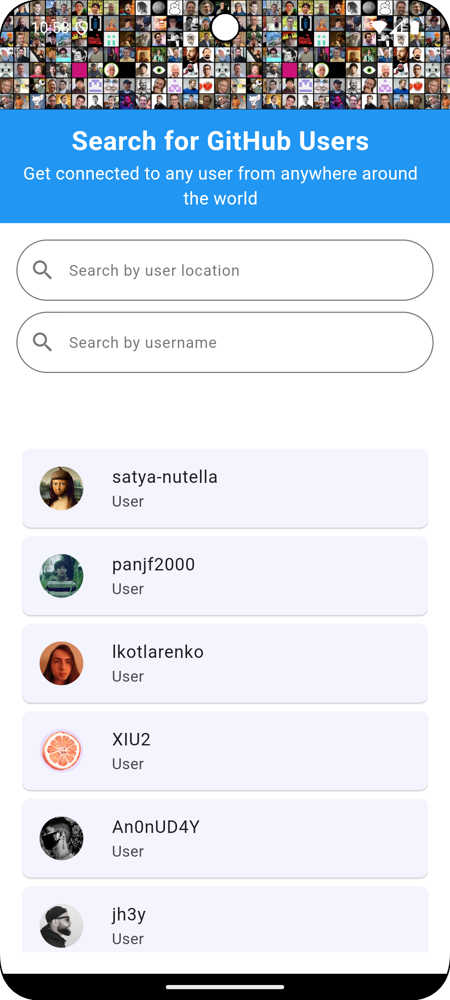
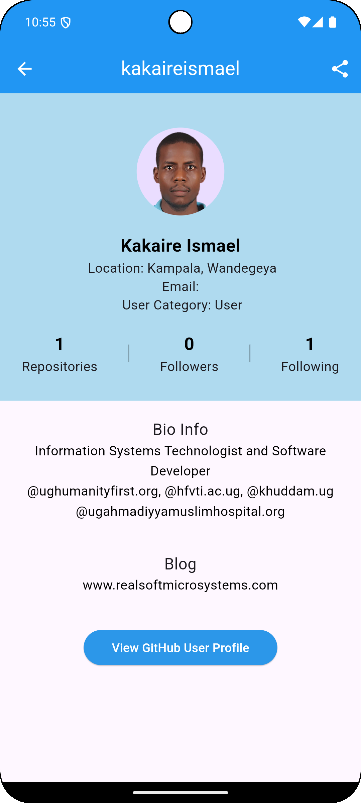
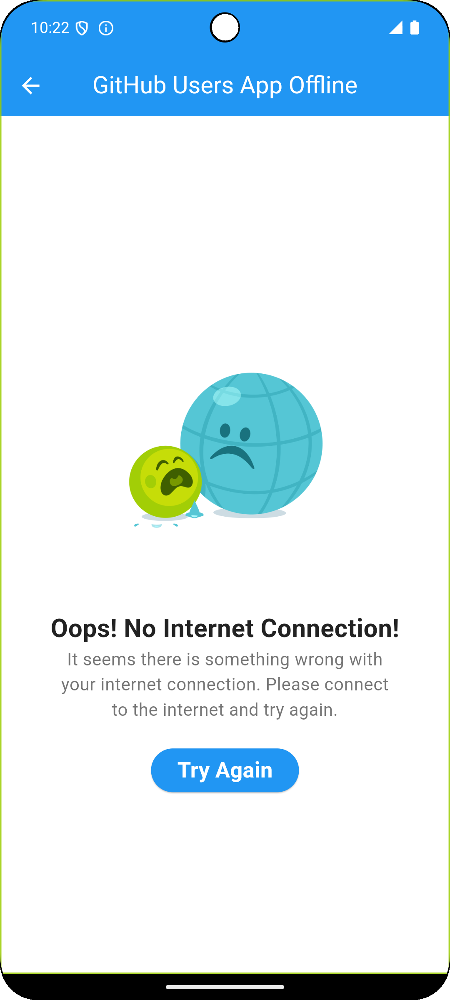

# GitHub Users App

This GitHub Users App is a mobile and web application that lets anyone search GitHub users from all over the world based on search queries and filters. It uses the GitHub API to fetch data and displays a list of matching users. It's useful for developers and recruiters to find and connect with other developers. It enables any one to browse and view GitHub users and their profiles via the GitHub API.

## Introduction

This GitHub Users App is a flutter designed application to enable any computer and mobile user to search for GitHub users from all over the world and view their profiles.
The main objective of this App is to enable users to search and get access to their profiles. The App provides users a simple, convenient, secure and efficient way to connect to millions of GitHub users across the world. 

By entering a user's GitHub username or location by country into the "GitHub Users search bar, you can find that user's profile information as well as links to their GitHub account. Every time you type something, the application will send a request to the GitHub API to search for the username you just typed, and any users who match the query will have their information displayed. 
The GitHub Users App is an easy to user and friendly application that makes it easy for you to discover other GitHub users based on their GitHub username or location. Any user simply types in the location (to search by user location e.g. Uganda) of the user or by using search user by username (e.g. kakaireismael) into the search box, and you'll be presented with information about the user you searched and view user profile and the link to view the respective GitHub User account.


## App Features

This App uses the following key features for any user experience;

-	### User Search Functionality: 
     Search for GitHub users by using a username or location. This feature allows you to search and browse GitHub users based on username or location.

-	### User Profile or Details: 
     This feature allows you to view detailed information about a specific user.
The information include User profile picture, location, email address, user category, public repositories, followers, following, bio details and blog address. You can as well visit and view GitHub User Profile by clicking on “View GitHub User Profile” button.

-	### Share Feature
    This feature allows you to share user profile to other social media apps such as WhatsApp, Facebook, Gmail and many more. You simply click on the share button located at the top right corner of the App Bar.

-	### Infinite Scroll Pagination
     This enhanced user experience and interaction feature enables the App user to continuously scroll through a list of GitHub users displayed on the screen as it loads and retrieves more users. As the user scrolls down, more GitHub Users are dynamically loaded, creating a seamless browsing experience.

-	### Internet Connectivity Check
    This feature checks and handles internet connectivity with prompts to guide user on how to get connected. It helps to check and manage internet connectivity and network requests effectively. It can check the status of the internet connection (Wi-Fi, Mobile data, or offline mode)
For instance, this feature detects if there is active Internet connectivity to let you continue using the App. If there is no internet connectivity found, the App prompts you to go to your device Internet settings to setup your Internet in order to get back to the App functionality.

-	### Clean Architecture Implementation: 
     This App implements clean architecture design to Structure codebase more modular, testable for better maintainability and scalability.

## Getting Started

Follow the instructions below to set up and run the project locally.

### Prerequisites

To run this application, ensure to have the following tools installed and running.

-	Android Studio or VS Code
-	Flutter SDK
-	Flutter plugin
-	Fast development machine (e.g. a desktop computer or a laptop)
-	Dart plugin
-	Flutter dependencies 

	


## Installation

Step-by-step instructions on how to install the project.

1. Clone the repository:
   ```sh
   git clone https://github.com/kakaireismael/GithubUsersApp 
   ```
2. Navigate to the project directory:
   ```sh
   cd GitHubUsersApp
   ```
3. Install dependencies:
   ```sh
   flutter pub get
   ```

## Running the App

Instructions on how to run the app on an emulator or a physical device.

1. Run the App:
   ```sh
   flutter run
   ```
#### Running the App

### Steps to Run on an Emulator
#### 1.	Start an Emulator:
 -     Android:
   1.	Open Android Studio.
   2.	Go to the AVD Manager (Android Virtual Device Manager) by clicking on the Device Manager icon or navigating through Tools > Device Manager.
   3.	Create a new virtual device if you don't have one. Select a device definition and a system image.
   4.	Start the emulator by clicking the Play button next to the virtual device.
 -     iOS:
   1.	Open Xcode.
   2.	Go to Xcode > Preferences > Components and ensure you have a simulator installed.
    3.	Open the simulator by navigating to Xcode > Open Developer Tool > Simulator.
#### 2.	Run the Flutter App:
- Open your Flutter project in your chosen IDE (e.g., Visual Studio Code, IntelliJ, or Android Studio).
- Open the terminal or use the terminal integrated into the IDE.
- 	Run
    -     flutter doctor 
     to ensure all dependencies are installed correctly.

- Run 
  -     flutter devices
   to check if your emulator is recognized by Flutter.
- 	Start your app with 
    -     flutter run 
  This will compile the app and run it on the active emulator.
### Steps to Run on a Physical Device
#### 1.	Set Up Your Device:
  -  	Android:
    1.	Enable Developer Options and USB Debugging on your device. This can usually be done by going to Settings > About phone and tapping the Build number seven times to unlock developer mode. Then, navigate to Settings > Developer options and enable USB Debugging.
     2.	Connect your device to your computer via USB.
   -     iOS:
     1.	Connect your iPhone to your Mac via USB.
     2.	Trust the computer on your iPhone when prompted.
     3.	Open Xcode and navigate to Preferences > Accounts. Add your Apple ID if not already added.
     4.	Open Devices and Simulators under the Window menu. Your device should appear here. Make sure it is unlocked and trusted.
#### 2.	Run the Flutter App:
- 	Open your Flutter project in your chosen IDE.
- 	Open the terminal or use the terminal integrated into the IDE.
 - 	Run 
    -     flutter doctor 
     to ensure all dependencies are installed correctly.
- 	Run 
    -     flutter devices 
    to check if your physical device is recognized by Flutter.
- 	Start your app with 
    -     flutter run 
    This will compile the app and run it on the connected device.

## Usage

When the App is launched on the screen of the device, you are navigated to the Welcome Page after the Splash screen has been displayed click on “GET STARTED” to navigate to the Homepage (Search GitHub Users).

From there, a list of GitHub users is displayed from which you can scroll. To search for a specific country, you can search using the 'Search by user Location' button, while to search for a specific user, you can search using the 'Search by Username' button. From thereon, you can select a user's name to navigate to their profile page which displays various information such as the country or number of public repositories, followers, email, bio details and so much more. You can even choose to be redirected to the user's profile or can even share the user's details by clicking of the share button located on the top left corner of the App Bar or click “view GitHub user profile button located at the bottom of the user profile screen or page.

## Screenshots

Below are some screenshots of the application.

### Launch Screen


### Splash Screen


### Welcome Page Screen


### HomePage Screen


### Search User by Location


### Search User by Username


### User Profile Screen


### Share User Profile


### Internet Connectivity Check


### Internet Settings


### Internet Settings


## Contributing

Guidelines for contributing to the project.

1. Fork the repository
2. Create your feature branch (`git checkout -b ft_amazing_feature`)
3. Commit your changes (`git commit -m 'feature(addfeature) : add some amazing feature'`)
4. Push to the branch (`git push origin ft_amazing_feature`)
5. Open a pull request

## Contact

To you can reach out on me using the following;
-	Tel: +256703314171/+256774059826
-	Email: kakaireismael86@gmail.com
-	GitHub: kakaireismael
-	GitHub Account: https://github.com/kakaireismael/GithubUsersApp


